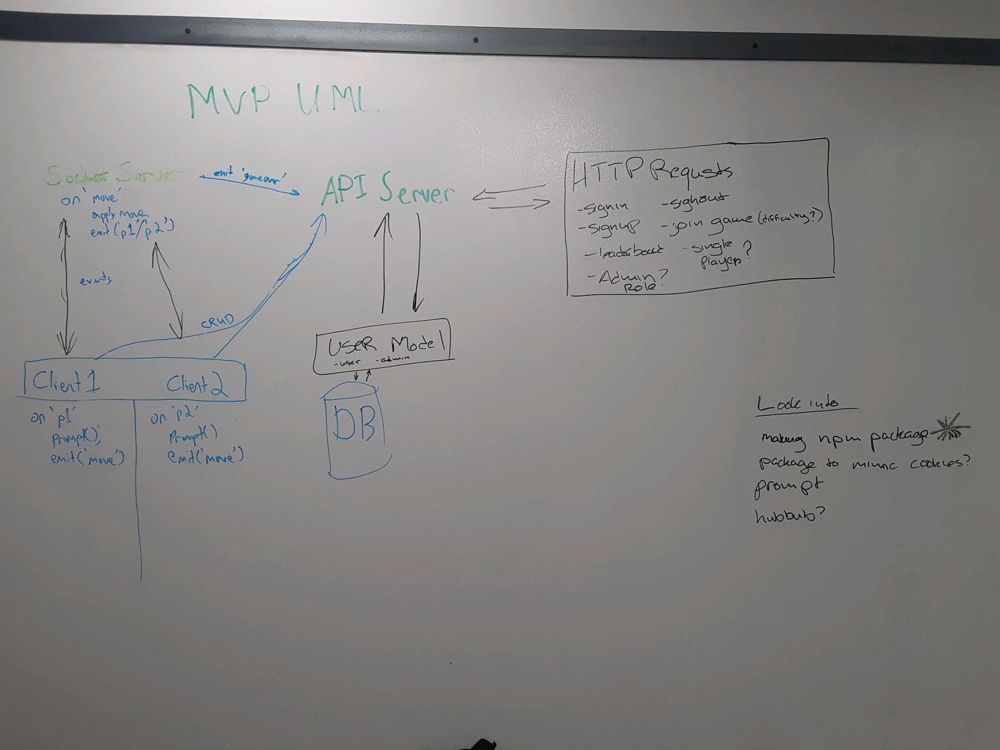

# 401 Midterm - Nimble

## Client

#### Authors: Becky, Chris, Joé, Morgana

## Links & Resources
* [GitHub Repo](https://github.com/401-advanced-javascript-nimble/client)
* [Heroku Deployment](https://nimble-api-server.herokuapp.com/)
* [Microsoft Azure Deploylment](https://401-advanced-javascript-nimble-socket-server.azurewebsites.net)
* [Travis]( --- )

### Documentation

### Modules
* `index.js` -- Initializes commander, a node.js command-line interface. Includes logic for handler functions for signup, signin, play, leaderboard, and signout.
* `src/commands/handle_leaderboard.js` -- Module with async function to render the leaderboard. Specifically, it requires **superagent** for AJAX requests to our server for user stats, **cli-table** to build the leaderboard table in the command line, and **figlet** to create ASCII Art from text.
* `src/commands/handle_play.js` -- Module with async function to validate user token and start new game.
* `src/commands/handle_signin.js` -- Module that requires **prompts** to create a more colorful CLI interface, **clear** to clear the terminal screen, and **figlet** to create ASCII Art from text. Specifically, it includes an async function that prompts user for username and password for **signin**.

* `src/commands/handle_signout.js` -- Module with logic to sign user out.

* `src/commands/handle_signup.js` -- Module that requires **prompts** to create a more colorful CLI interface, **clear** to clear the terminal screen, and **figlet** to create ASCII Art from text. Specifically, it includes an async function that prompts user for username and password for **signup**.

* `src/lib/User.js` -- Module that requires **superagent** for AJAX requests to our server, and **configstore** as a means to store user data. A User class is defined with methods to create, hold, and delete a user authentication token. This is used to communicate the user's win/loss status of the current game to the API Server.

* `src/lib/game.js` -- Module that requires **socket.io-client**, and **prompts**. A Game class is defined and includes logic for the **client socket** to react to events such as a message from the server, a new turn, turn countdown, clear line after timeout, game over, and game win. It also includes logic for **prompt functionality** such as 'Which stack?' and 'How much?', and **client-side game logic** to validate stack and amount provided by user.

* `src/lib/welcome_screen.js` -- Module that requires **prompts**, **figlet**, **clear**, and **configstore**, to render the welcome screen and menu. Exports an async function that checks whether player is a new or existing user.

* `src/utils/menu.js` -- Module that requires **prompts**. Exports an async function for menu options play, leaderboard, signout.

* `src/utils/questions.js` -- Module that exports logic for prompts for welcome, signup, or signin.

* `src/utils/validate_email.js` -- Module that exports logic for utility function that uses a regex to validate whether an email is valid.

* `src/utils/validate_password.js` -- Module that exports logic for utility function that uses a regex to validate whether a password is valid.

### Setup
#### `.env` Requirements
* SECRET -- token generation
* MONGODB_URI -- database location
* TOKEN_EXPIRATION_TIME -- token lifetime
* PORT -- port to use (when running locally)
* API_SERVER_URI=https://nimble-api-server.herokuapp.com
* SOCKET_SERVER_URL=https://401-advanced-javascript-nimble-socket-server.azurewebsites.net

### Running the App
* `POST /signup` -- Add a user to the database.  If the user's role is a superuser, they will be provided a key, otherwise the user will receive a token.  Requires: username, password, email
Optional: role
* `POST /signin` -- Passes through auth middleware to verify username and password, and provides a new token if successful.
Requires: username, password
* `GET /leaderboard`
* `PUT /socket` -- Used for the socket server/client to send updates after a game to be saved to the database.
Requires: stats: {wins}
* `GET /admin`

### Operating Instructions
* The RESTful API server runs live at https://nimble-api-server.herokuapp.com/. Perform the above requests to interact with the API. 

#### Tests
* How do you run tests?
* What assertions were made?
* What assertions need to be / should be made?

#### UML
