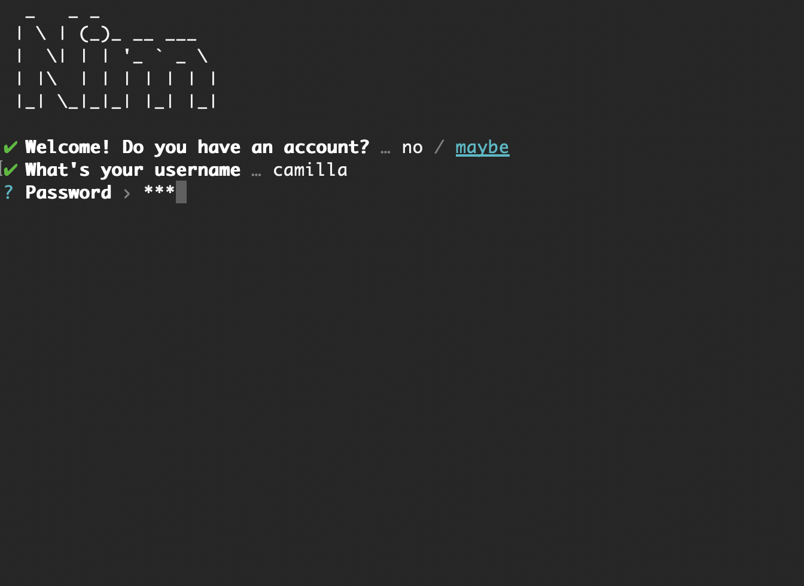
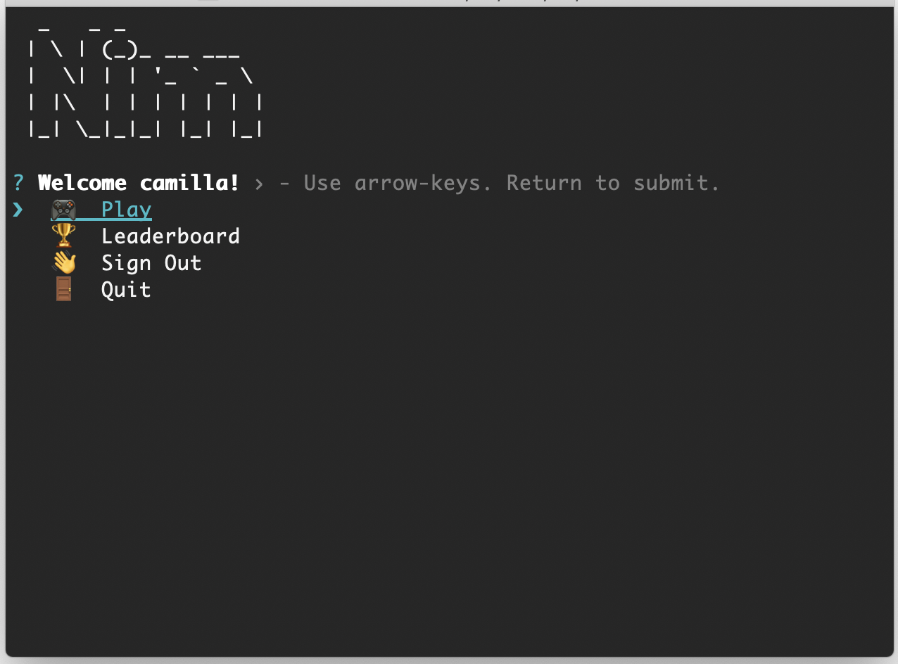
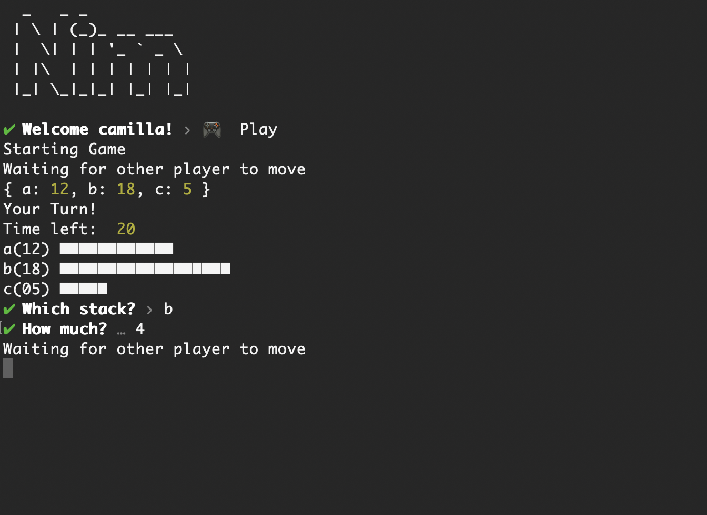
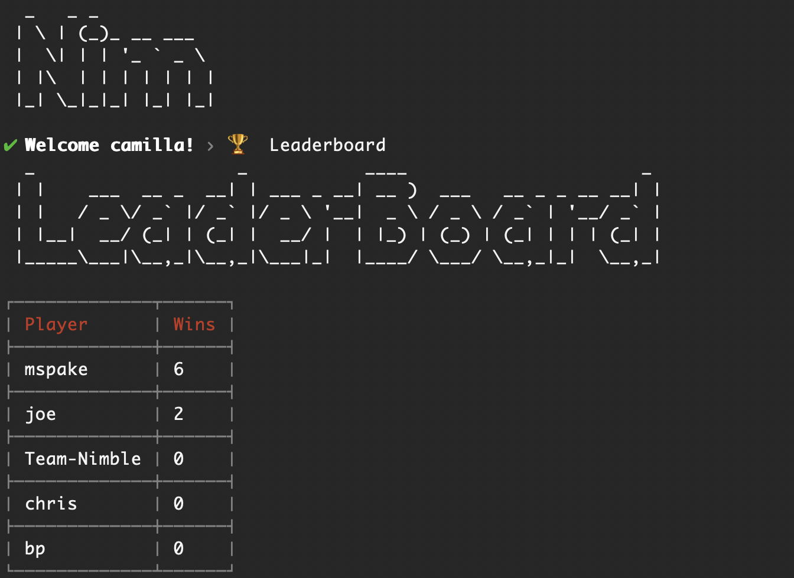

# @team-nimble/client 
#Nim
A mathmatical game of strategy. 😈

Force your oponent's hand to take the last item from the stacks!

#### Authors: Becky, Chris, Joé, Morgana

## Game Play

* run `npm i -g @team-nimble/client`
* run `nim`

Create an account!

Use your arrow keys and return button to start a new game.

Use your arrow keys to select a stack. Then, use your number pad or arrow keys to select an amount to remove from the stack.

You can also checkout your high scores on the leaderboard.
